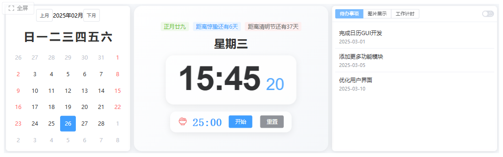
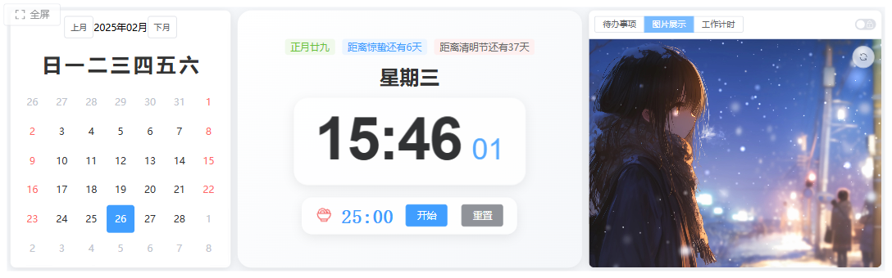
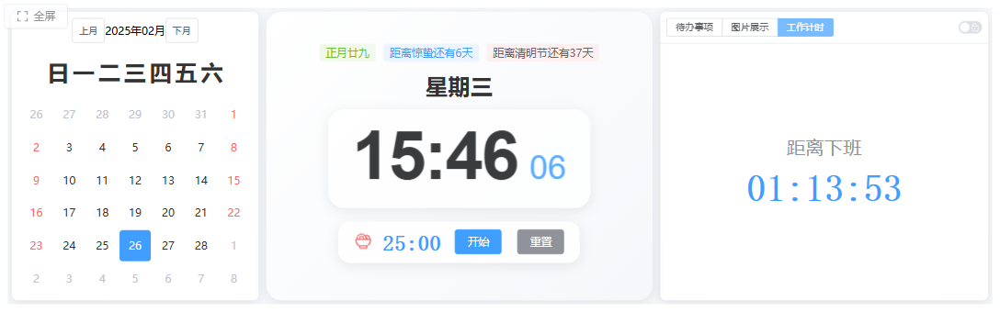

# Mini Screen Calendar

A secondary work display interface optimized for small screens, providing reminders for time, tasks, and dates.

## Screenshot






## Features

- 📅 Full-month calendar view with current date highlighting
  - Weekend days highlighted in red
  - Current date indicator
  - Previous/Next month navigation
- ⏰ Real-time clock display with animations
- 🌙 Lunar calendar integration
  - Current lunar date
  - Solar terms (节气) display
  - Next holiday countdown
- ✅ Todo list management with due date tracking
- 🖥️ Optimized for 1280x400 horizontal displays
- 🎨 Modern UI with gradient backgrounds and smooth animations
- 🍅 Pomodoro timer
  - 25-minute countdown timer
  - Start/Pause functionality
  - Reset option
  - Visual timer status indicator

## Roadmap

Upcoming features and improvements:

- 📱 Remote todo management
  - Add/edit/delete todos from other devices
  - Real-time synchronization

- ⏳ Countdown timer for important dates
  - Custom event countdown
  - Anniversary reminders
  - Holiday countdown

## Tech Stack

### Frontend
- Vue 3
- TypeScript
- Element Plus UI
- Day.js for date handling
- Lunar Calendar support

### Backend
- Go
- Gin web framework
- Cross-platform compilation support

## Building

### Prerequisites
- Node.js >= 16
- pnpm >= 8
- Go (latest stable version)
- Git

### Development Build

1. Clone the repository:
```bash
git clone https://github.com/skadandy/mini-screen-cal.git
cd mini-screen-cal
```

2. Install frontend dependencies:
```bash
cd frontend
pnpm install
```

3. Start frontend development server:
```bash
pnpm dev
```

4. Start backend (in another terminal):
```bash
cd backend
go run main.go
```

### Production Build

Use the included build script:
```bash
./build.bat  # Windows
```

This will:
1. Build the frontend
2. Copy static files to backend
3. Compile backend for Raspberry Pi (ARM64)

## Deployment (Raspberry Pi)

1. Copy the following files to your Raspberry Pi:
   - `backend/cal-gui` (executable)
   - `backend/dist/` (frontend files)
   - `backend/start.sh` (startup script)

2. Make the files executable:
```bash
chmod +x cal-gui
chmod +x start.sh
```

3. Start the application:
```bash
./start.sh
```

The application will be available at `http://localhost:8080`

## Development

- Frontend code is in the `frontend/` directory
- Backend code is in the `backend/` directory
- Build scripts are in the root directory

## License

MIT License
